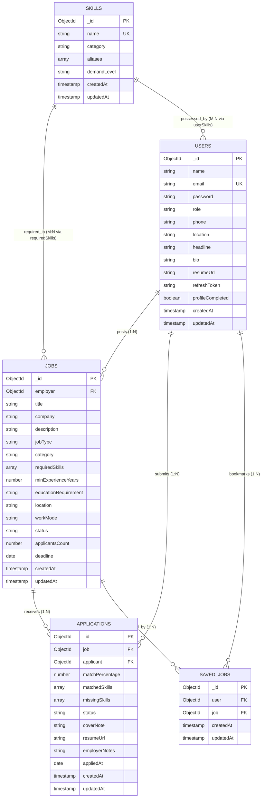

# 🗄️ Smart Career Role Match AI Job System

## Database Design, Relational Schema & Normalization Report (1NF, 2NF, 3NF)

> **Academic Reference for FYP Documentation — Chapter 3 (Database Architecture & SRS)**

---

## 1. Executive Summary & Entities Overview

The database for **Smart Career Role Match AI Job System** is architected using **Mongoose ODM on MongoDB**, structured with relational integrity, strict schema validation, foreign key references, and multi-field compound indexes.

### Core Normalized Entities (Collections):

1. **`Users` (Entity 1):** Master entity for Candidates (`student`, `fresh_graduate`, `professional`), `employer`, and `admin`.
2. **`Skills` (Entity 2):** Centralized taxonomy for standardized technical skills, categories, and aliases.
3. **`Jobs` (Entity 3):** Job postings created by authenticated Employers with weighted skill criteria.
4. **`Applications` (Entity 4):** Transactional junction entity linking Candidates to Jobs with calculated **Match %**, **Matched Skills**, and **Missing Skills**.
5. **`SavedJobs` (Entity 5):** Bookmark junction entity between Users and Jobs.

---

## 2. Entity-Relationship Diagram (ERD)

---

## 3. Database Normalization (Step-by-Step Proof)

### 🟢 First Normal Form (1NF)

- **Rule:** Every column must hold atomic (indivisible) values. There must be no multi-valued attributes mixed in a single column or repeating group columns (e.g., `skill1`, `skill2`, `skill3`).
- **Implementation:**
  - All atomic fields (`name`, `email`, `role`, `location`, `salary`) store singular scalar values.
  - Repeating skills are not stored as unparsed comma-separated strings (`"React, Node, Mongo"`). Instead, they are decoupled into standardized arrays of objects referencing the `Skill` entity with explicit typing.
  - Every record is uniquely identifiable by an immutable **Primary Key** (`_id: ObjectId`).

---

### 🟢 Second Normal Form (2NF)

- **Rule:** Must be in 1NF, and all non-key attributes must be fully functionally dependent on the primary key (No Partial Dependency on composite keys).
- **Implementation:**
  - In the `Applications` entity, the composite relationship is between `job` (FK) and `applicant` (FK).
  - Attributes like `matchPercentage`, `matchedSkills`, and `missingSkills` depend purely on the **pair** of `(job, applicant)` — they do not belong exclusively to the candidate or exclusively to the job.
  - Candidate details (`name`, `headline`) and Job details (`title`, `company`) are strictly kept in their respective master tables (`Users` and `Jobs`), eliminating redundant duplicate storage.

---

### 🟢 Third Normal Form (3NF)

- **Rule:** Must be in 2NF, and there must be no Transitive Dependencies ($X \to Y \to Z$ where a non-key attribute depends on another non-key attribute).
- **Implementation:**
  - **Skills Normalization:** In traditional unnormalized schemas, a job would store `skillName`, `skillCategory`, `skillAliases`. If the category changed, multiple jobs had to be updated (Update Anomaly). We extracted skills into the dedicated `Skills` collection. The category depends exclusively on `Skill._id`.
  - **Employer & Company Normalization:** Employer credentials (`email`, `password`, `role`) depend on `User._id`. The employer's job postings depend on `Job._id` and reference `employer: User._id`.

---

## 4. Keys & Integrity Constraints Summary

| Collection         | Primary Key      | Foreign Keys                                            | Unique / Compound Constraints                                                |
| ------------------ | ---------------- | ------------------------------------------------------- | ---------------------------------------------------------------------------- |
| **`Users`**        | `_id` (ObjectId) | None                                                    | `email` (Unique Index)                                                       |
| **`Skills`**       | `_id` (ObjectId) | None                                                    | `name` (Unique Index)                                                        |
| **`Jobs`**         | `_id` (ObjectId) | `employer` $\to$ `Users._id`                            | `_id`, Index on `(status, createdAt)`                                        |
| **`Applications`** | `_id` (ObjectId) | `job` $\to$ `Jobs._id` `applicant` $\to$ `Users._id` | **Compound Unique:** `(job, applicant)` _Prevents duplicate applications_ |
| **`SavedJobs`**    | `_id` (ObjectId) | `user` $\to$ `Users._id` `job` $\to$ `Jobs._id`      | **Compound Unique:** `(user, job)` _Prevents duplicate bookmarks_         |

---

## 5. Performance Indexing Strategy

1. **`Users` Collection:**
   - `{ email: 1 }` (Unique): $O(1)$ fast authentication and login lookups.
   - `{ role: 1 }`: Accelerated role-based filtering (Candidate vs Employer).
2. **`Jobs` Collection:**
   - `{ employer: 1 }`: Fast employer dashboard loading.
   - `{ status: 1, createdAt: -1 }`: Instant home page / job feed rendering.
   - `{ title: 'text', description: 'text' }`: Full-text search support.
3. **`Applications` Collection:**
   - `{ job: 1, applicant: 1 }` (Unique): Guarantees data integrity.
   - `{ job: 1, matchPercentage: -1 }`: Instant ranking of applicants by highest match score for recruiters.
   - `{ applicant: 1, createdAt: -1 }`: Quick candidate application history.
